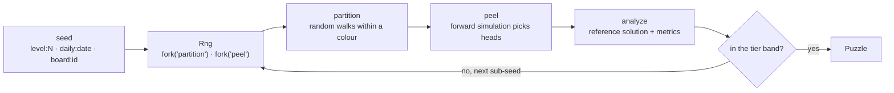

# Architecture

How the repository is put together and why. [PRODUCT.md](PRODUCT.md) says what we are building.

## Goals and constraints

- **Deterministic content.** Level N and the daily of a date are the same puzzle on every phone,
  forever. Every random draw goes through a seeded `Rng`; `Math.random` is banned by ESLint.
- **Measured difficulty.** No puzzle ships unmeasured: the solver rates every generated puzzle,
  and calibration suites keep the tiers inside the bands the product document promises.
- **Pure engine.** `packages/engine` has zero dependencies and no DOM, so it runs in the app, in
  Node for tests and tools, and on a server if one ever exists. The UI never decides outcomes.
- **Testable in the cloud.** Everything but the iOS build runs on Linux. Claude Code Cloud can
  change and verify any part of the logic or the web UI.

## Packages

| Package           | Role                                                                        | May import     |
| :---------------- | :-------------------------------------------------------------------------- | :------------- |
| `packages/engine` | Boards, generator, solver, difficulty, tiers, game state, league sim        | Nothing        |
| `apps/game`       | The Vite app: rendering, input, screens, persistence (ads, Capacitor later) | engine         |
| `tools`           | Build-time tools: drawings from PNG art (`pngjs`), never shipped            | engine (types) |

Workspace packages export their TypeScript sources (`"exports": "./src/index.ts"`), so Vite,
Vitest and `tsc` consume the source directly. The engine also has a real build (`tsc -p
tsconfig.build.json` into `dist/`) for anything that consumes plain JavaScript.

### Drawings from PNG art

Drawings are pixel art in `art/drawings/`: one PNG per drawing, one pixel per cell, transparent
where there is no cell, every other pixel exactly one colour of the drawing palette.
`art/drawings/drawings.json` names each colour (`#a83e34` is `red`, as the theme names them) and,
per drawing, its id, name, file and legend (character to colour name, in palette order).
`pnpm drawings` runs `tools/png-to-drawing.ts`, which reads every PNG and writes
`packages/engine/src/drawings/art.ts`, formatted with Prettier; the engine's `DRAWINGS` is that
module. A pixel off the palette, half transparent, of a colour the legend does not name, or a
legend colour never drawn fails with the file and the pixel. `pnpm drawings:check`, in CI, fails
when `art.ts` is not what the art makes, so nobody edits the generated module by hand. The engine
gains no dependency: `pngjs` belongs to the tools.

## Engine

### Module map

| Module       | Contents                                                                                                                     |
| :----------- | :--------------------------------------------------------------------------------------------------------------------------- |
| `rng/`       | `createRng(seed)`: xoshiro128\*\* seeded from a string hash, with `fork(label)` for independent streams                      |
| `board/`     | `Cell`, `Direction`, `Mask` (active cells and colours), `Path`, `Arrow`, `Puzzle`; mask constructors                         |
| `generator/` | `partition` (phase one), `peel` (phase two), `generatePuzzle`, `generateInBand`                                              |
| `solver/`    | `Occupancy` and the allocation-free ray scan; `analyze` (reference solution and metrics)                                     |
| `game/`      | `GameState`: `createGame`, `tap`, `hint`, `freeArrows`, `arrowAt`. Immutable, UI-agnostic                                    |
| `levels/`    | Tiers and their knobs, `tierForLevel`, `boardSizeForLevel`, `generateLevel`, `generateDaily`, boards                         |
| `drawings/`  | `Drawing` (rows and legend), `drawingMask`, `findDrawing`; `art.ts`, generated from art/drawings (see Drawings from PNG art) |
| `league/`    | Character names, `scoreBoard`, seasons, character score curves, standings, promotion rules                                   |
| `debug/`     | `renderAscii`, for tests, fixtures and bug reports                                                                           |

### The rule

An arrow is a path of adjacent cells; its head is the last cell and points along the last
segment. The arrow is free when the ray from its head to the edge is empty, counting every
occupied cell, its own body included. `rayStatus` scans that ray on an `Int32Array` of cell
owners and reports its length and its blockers without allocating.

Two ray modes exist for drawings: `bounds` runs the ray to the bounding rectangle (inactive cells
are empty space), `mask` stops it at the first inactive cell.

### Generation

1. **Partition.** Active cells are visited in random order; from each unowned cell a walk claims
   free same-colour neighbours up to a sampled target length (geometric from the mean, capped).
   The walk prefers the neighbour with the fewest free neighbours (Warnsdorff's rule), which
   strands fewer single cells; a final pass attaches remaining singles to an adjacent path end.
2. **Peel.** The solution is simulated forward on the full board. At each step every path with
   an end whose ray is free is a candidate; one is chosen (uniformly, or with `bias` towards the
   longest ray, which puts heads deeper inside), that end becomes the head, and the path leaves.
   Removal only frees cells, so the greedy process never backtracks. If no end is free, the
   topmost occupied cell is cut out of its path as a single cell pointing up, which is free by
   construction; the count of such repairs is reported. The peel order is a valid solution, and
   ids are then assigned by head position so the ids do not leak the order.
3. **Verify and rate.** `analyze` plays the puzzle with a fixed policy (shortest free ray first)
   and measures: arrows, cells, path lengths, free arrows per step, free over remaining
   (`avgFreeRatio`, the main signal), ray length at removal, near misses, heads on the border.
   A puzzle that does not solve is a bug and throws.
4. **Band selection.** `generateInBand` tries sub-seeds `seed#0`, `seed#1`, ... and keeps a
   candidate inside the tier's band (the easiest, the hardest or the first, per tier), or the
   nearest. Deterministic: the same seed always picks the same candidate.

What the measurements say: the number of free arrows at any moment is about 3 to 6 on any
board, so the playable share of the board falls with the number of arrows. Board size is the
main difficulty knob; the peel bias lengthens rays; picking the hardest of several candidates
trims easy outliers. The bands overlap on purpose, as in the reference game, where the label is
relative to the position on the level path.

### Content pins

`levels.test.ts` pins the fingerprint of a few levels. Any change to the RNG, the partition,
the peel, the tiers or the band selection changes every player's level N; the pin makes that a
deliberate decision with a changelog entry, never an accident.

### League simulation

`generateSeason(league, dayKey)` derives 29 characters from the seed `league:<index>:<day>`: a
name, an avatar index, a daily total drawn log-normally around the league's median, and one to
four sessions at typical times of day. `characterScoreAt(character, secondsOfDay)` sums the
sessions' smooth ramps, so the table moves during the day with no server and no stored state.
`standings` ranks the player among them; `resolveDay` applies the top-10 and bottom-10 rules.
The calibration suite simulates 120 days per league and keeps promotion rates in the bands the
product document sets.

## App

`apps/game` is a Vite app in vanilla TypeScript and DOM, with no UI framework. `index.html` plays
the puzzle named by the URL (`?level=N`, `?daily=YYYY-MM-DD`, `?drawing=id&tier=t`), shows the daily
calendar (`?calendar`, or `?calendar=YYYY-MM` for a month), the daily league (`?league`), or the
home screen when the URL names nothing (or something invalid); `dev.html` opens any puzzle by seed
and shows what the solver measured, and the home screen's menu button leads to it. Its Preview shows
any day, but its Play link follows the game's rules: a day ahead of today, or before the first
daily, opens the calendar.

### Module map

| Module                   | Contents                                                                                                                                                                                                                                                                                                                                                           |
| :----------------------- | :----------------------------------------------------------------------------------------------------------------------------------------------------------------------------------------------------------------------------------------------------------------------------------------------------------------------------------------------------------------- |
| `theme/`                 | `Theme` (colours, tier colours, drawing palette, avatar colours, shadows, board geometry, chance direction, icons, fonts, motion) and `applyTheme`, which writes CSS custom properties; `default.ts` is the Paper theme of [DESIGN.md](DESIGN.md); `contrast.test.ts` holds every pairing the screens use to WCAG AA, with the drawing palette's known gaps listed |
| `board/geometry.ts`      | Pure: arrow body and head shapes, exit track, grid lines, board bounds, in cell units                                                                                                                                                                                                                                                                              |
| `board/viewport.ts`      | Pure: zoom and pan as data (fit, clamp, `zoomAt`, `pinchView`, `panBy`, `cellAt`, `ensureVisible`)                                                                                                                                                                                                                                                                 |
| `board/gestures.ts`      | Pure: pointer events in, `tap`, `pan`, `pinch` and `pinchEnd` actions out                                                                                                                                                                                                                                                                                          |
| `board/renderer.ts`      | SVG drawing: one `<g data-arrow>` per arrow, exit and bump animations, hint, grid                                                                                                                                                                                                                                                                                  |
| `game/`                  | `PlaySession` (engine state, timer, hints) and `Stopwatch`                                                                                                                                                                                                                                                                                                         |
| `app.ts`                 | The shell: shows the screen an address names, records level, daily and league results in their stores, pushes the next level onto the history, opens the calendar instead of a day that cannot be opened yet, and shows the league's summary of the last day played once                                                                                           |
| `screens/home.ts`        | The home screen: wordmark, streak chip, the Levels card with its strip and Play, the Daily, League and Event cards                                                                                                                                                                                                                                                 |
| `screens/calendar.ts`    | The daily calendar: a month in weeks from Monday with stars, today and locked days, month buttons that redraw in place, the trophies row, Play today                                                                                                                                                                                                               |
| `screens/league.ts`      | The daily league: the league's name and countdown, the rules, the table of 30 with avatars, tags and the dividers where moves happen; the rules and the day's summary in sheets; a 30 s clock that moves the table and settles the day at midnight                                                                                                                 |
| `events/`                | The event catalog (`AUTUMN_2026`: dates, boards in order, the badge), `eventState`, `eventOn`, `daysLeft`                                                                                                                                                                                                                                                          |
| `league/`                | `LeagueProvider`, what the screens need of a league; `SimulatedLeagueProvider`, the league against the game's characters on the device (engine `generateSeason`, `standings`, `resolveDay`, `scoreBoard`)                                                                                                                                                          |
| `daily/`                 | Pure: `days.ts` (local day key, month arithmetic, `DAILY_FIRST_DAY`, which days can be opened) and `month.ts` (the month model, the trophies row, a complete month)                                                                                                                                                                                                |
| `screens/play.ts`        | The play screen: wires input to the session and results to the renderer, HUD and overlay                                                                                                                                                                                                                                                                           |
| `persistence/`           | `KeyValueStore` with `WebStore` (localStorage, never throws), `MemoryStore` and `browserStore()`; `RecordSlot`, one versioned JSON record; `ProgressStore` (the level path), `DailyStore` (days won), `LeagueStore` (the player's league and day) and `EventStore` (boards won per event) on top of it                                                             |
| `levelStrip.ts`          | Pure: the seven levels around the current one, with their tiers and states                                                                                                                                                                                                                                                                                         |
| `ui/`                    | HUD (top bar and tool bar), `Chances` (the arrowhead lives and their breaking animation), the end-of-board sheet, DOM helpers                                                                                                                                                                                                                                      |
| `route.ts`, `puzzles.ts` | URL to route (home, calendar, league, puzzle: level, daily, event board, drawing), `puzzleKey` (one key per board, for the league's once a day); reference to generated puzzle, with its title and the line under it                                                                                                                                               |
| `strings.ts`             | Every player-facing string, keyed, with `{placeholders}`                                                                                                                                                                                                                                                                                                           |

### Progress and navigation

Each record the app keeps lives under its own key as JSON with a `version`, behind a
`RecordSlot`. Progress, under `arrows.progress` with `version: 1`, holds the current level,
the best time per level won, the streak and the best streak, and the levels lost and not won
since (so a win after leaving and coming back is not a first try). Chances belong to a board and
are not stored. `parseProgress` reads field by field and falls back to the initial value for
anything missing or malformed; the place for a migration is marked in it. A record with a newer
version, written by a later build, is never overwritten: an older build plays on in memory.

Daily results, under `arrows.daily` with `version: 1`, hold the best time of each day won, keyed
by day; a lost day is not stored, and a day stored is a star. The calendar's month model reads
the set of days won, and counts only days that can be opened, so a day stored ahead of today (a
changed clock, a bad write) earns nothing until its day comes.

A `RecordSlot` reads the store on every call and writes from what it just read, so a second tab,
or a page the browser kept in its back-forward cache, never writes an out-of-date copy over newer
progress. `WebStore` reads localStorage each time and keeps a write it refuses (a full quota) in
memory for the rest of the visit; `browserStore()` falls back to memory only where touching
localStorage throws.

The play screen reports a result through `record` at the tap that wins or loses, before the last
animation, so leaving during it still counts; `firstTry` is false once a board of that puzzle was
lost while it was open. Only `App` writes the records: levels move the path and the streak, a
replay of a level already won only keeps its best time, a won daily earns its star, and events
are not stored yet.

Links on the home screen and the back button load the page anew, so each adds a history entry; "Next
level" pushes the new address onto the history, and `popstate` shows what the address names. The
calendar's month buttons redraw it in place and replace the address, so Back still leads home. A
daily's back button and its sheets lead to its month in the calendar. An address naming a day ahead
of today, or before the first daily, opens the calendar instead and replaces the address. When the
browser restores a page from its back-forward cache (`pageshow` with `persisted`), or another tab
saves progress (`storage`), `App.refresh` draws the home screen, the calendar or the league again if
one is showing, and puts focus back on the same control; a board in play is left as it is. The
calendar says a new month through a live region, since focus stays on the month button.

The day is the device's local date (`localDateKey`), read from the app's `clock` when a screen is
drawn; date names come from tables in `strings.ts` rather than `Intl`, whose output differs
between engines.

### Daily league

`SimulatedLeagueProvider` keeps only the player's own state, under `arrows.league` with
`version: 1`: the league, the day the points belong to, the points, the keys of the boards that
earned them (`puzzleKey`: each board counts once a day), and the summary of the last day settled
until it is seen. The 29 characters are never stored: `generateSeason(league, day)` makes them
again, and `standings` places them at the local time of day, so the table moves while the app is
open (the league screen redraws every 30 s) and while it is closed.

Every call reads the state and first brings it to today. The first call on a new day settles the
last day played with its final table (`standings` at the end of the day, `resolveDay`,
`nextLeague`) and keeps its summary; a day without a board won changes nothing, and neither do
the days missed between, so several missed days settle once. A stored day after today (a clock
set back) is dropped unsettled. The summary shows once, on the home screen or the league,
whichever comes first.

### Events

An event (`events/catalog.ts`) runs from a first to a last local day and lists its boards in
order, each a drawing at a tier with its own seed (`generateBoard` with the id
`event:<event>:<n>`, the `bounds` ray rule). `EventStore` keeps the board numbers won per event
under `arrows.events`. `App` opens an event board only while the event runs, and only up to the
next board not won: an address naming a board further on opens the next one, and one outside
the event's days opens the home screen. A board's first win adds the line "Board 2 of 6 done."
and, on the last, the badge; "Next board" leads on while the event runs. Event boards earn
league points with the event bonus. The home screen shows the running event, or the one that
ended last: a thumbnail of the next board, a segment per board, and the days left or the end.

Until a board is won today the player is not in the day's table: the view lists them last,
without a move, below characters still at 0 (the engine's `standings` would give them the tie).

Two limits are accepted. The home screen does not tick: its League card shows the countdown as it
was when drawn, and the day settles on the next screen drawn (the league screen ticks every
30 s). Where the clocks go back at midnight (Santiago, Asunción, Havana), the local date goes back
an hour: a board won in that hour reads as a clock set back and is dropped, and the repeated
day can settle twice. The day key may move to a fixed time zone later (docs/PRODUCT.md).

The win sheet's league line comes from `App.record`: every board won is scored with
`scoreBoard` (tier, cells, time, chances lost, and the event bonus for drawings). A server-backed
provider can replace the simulated one behind `LeagueProvider` when real players join.

### Rendering and input

The look is the one of [DESIGN.md](DESIGN.md): Instrument Serif and Geist ship with the build
from their Fontsource packages (`@fontsource/instrument-serif`, latin subset;
`@fontsource-variable/geist`), so the app needs no network for fonts.

The board is SVG in cell units: a cell is 1 by 1, lines run through cell centres with round caps
and joins, so neighbouring paths are a cell apart and never touch. One `transform` on the board
group carries zoom and pan, so strokes scale with the zoom. An arrow leaves along its exit track:
the body line plus the straight run of its ray; a dash the length of the body slides along the
track while the head translates along the ray, so the body follows the head's track.

Input goes through `GestureTracker`. A press that stays within 8 px and lasts under 500 ms is a
tap, resolved to a cell with `cellAt` at the current zoom, then to an arrow with the engine's
`arrowAt`. A pinch step is computed from the view at the start of the pinch: the board point that
was under the fingers goes under their midpoint, at the starting scale times the finger spread,
and the result is clamped once. Computing it step by step instead lets edge clamping move the
board away from the fingers.

## Enforced rules

| Rule                                 | Enforced by                                                                        |
| :----------------------------------- | :--------------------------------------------------------------------------------- |
| No `Math.random` anywhere            | ESLint `no-restricted-properties` (`repo/no-math-random`)                          |
| Engine has no browser globals        | ESLint `no-restricted-globals` (`repo/engine-purity`)                              |
| Engine never imports the app         | ESLint `no-restricted-imports` (`repo/engine-purity`)                              |
| Every generated puzzle is solvable   | `generatePuzzle` throws otherwise; property tests over thousands of seeds          |
| Tiers stay in their bands            | `levels.calibration.test.ts` over levels 1 to 400                                  |
| League promotion rates stay in bands | `league.calibration.test.ts` over 120 simulated days per league                    |
| Level content does not drift         | Fingerprint pins in `levels.test.ts`                                               |
| Drawings are what the art makes      | `pnpm drawings:check` in CI; `tools/drawings.test.ts` round-trips every PNG        |
| Colours only in the theme            | ESLint `no-restricted-syntax` (`repo/theme-colours`); `styles.test.ts` for the CSS |
| Web build under 300 kB gzipped       | The `arrows:size-budget` plugin in `apps/game/vite.config.ts` fails the build      |

## Testing

- `pnpm test`: unit and property tests, in seconds, on every commit (Husky) and in CI.
- `pnpm test:calibration`: the long suites, in their own CI job.
- `pnpm test:e2e`: Playwright against the production build, on a touch phone profile
  (390 by 844) and a desktop profile. The tests use the engine as their oracle: the page and the
  test generate the same puzzle from the same seed, so a test knows which arrows are free or
  blocked without the page exposing it. Claude Code cloud sessions use the Chromium at
  `/opt/pw-browsers/chromium` and must not run `playwright install`; CI installs its own.

Tests are next to the code (`*.test.ts`), calibration suites are `*.calibration.test.ts`, and the
app's end-to-end specs are in `apps/game/e2e/`.
