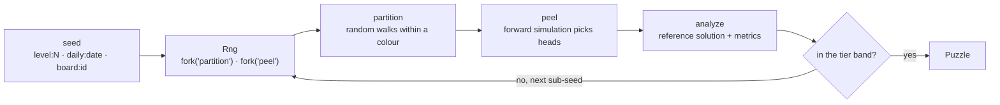

# Architecture

How the repository is put together and why. [PRODUCT.md](PRODUCT.md) says what we are building.

## Goals and constraints

- **Deterministic content.** Level N and the daily of a date are the same puzzle on every phone,
  forever. Every random draw goes through a seeded `Rng`; `Math.random` is banned by ESLint.
- **Measured difficulty.** No puzzle ships unmeasured: the solver rates every generated puzzle,
  and calibration suites keep the tiers inside the bands the product document promises.
- **Pure engine.** `packages/engine` has zero dependencies and no DOM, so it runs in the app, in
  Node for tests and tools, and on a server if one ever exists. The UI never decides outcomes.
- **Testable in the cloud.** Everything but the iOS build runs on Linux. Claude Code Cloud can
  change and verify any part of the logic or the web UI.

## Packages

| Package           | Role                                                                 | May import |
| :---------------- | :------------------------------------------------------------------- | :--------- |
| `packages/engine` | Boards, generator, solver, difficulty, tiers, game state, league sim | Nothing    |
| `apps/game`       | The Vite app: rendering, input, screens, persistence, ads, Capacitor | engine     |

Workspace packages export their TypeScript sources (`"exports": "./src/index.ts"`), so Vite,
Vitest and `tsc` consume the source directly. The engine also has a real build (`tsc -p
tsconfig.build.json` into `dist/`) for anything that consumes plain JavaScript.

## Engine

### Module map

| Module       | Contents                                                                                                |
| :----------- | :------------------------------------------------------------------------------------------------------ |
| `rng/`       | `createRng(seed)`: xoshiro128\*\* seeded from a string hash, with `fork(label)` for independent streams |
| `board/`     | `Cell`, `Direction`, `Mask` (active cells and colours), `Path`, `Arrow`, `Puzzle`; mask constructors    |
| `generator/` | `partition` (phase one), `peel` (phase two), `generatePuzzle`, `generateInBand`                         |
| `solver/`    | `Occupancy` and the allocation-free ray scan; `analyze` (reference solution and metrics)                |
| `game/`      | `GameState`: `createGame`, `tap`, `hint`, `freeArrows`, `arrowAt`. Immutable, UI-agnostic               |
| `levels/`    | Tiers and their knobs, `tierForLevel`, `boardSizeForLevel`, `generateLevel`, `generateDaily`, boards    |
| `drawings/`  | Pixel-art boards as text, with `drawingMask`                                                            |
| `league/`    | Character names, `scoreBoard`, seasons, character score curves, standings, promotion rules              |
| `debug/`     | `renderAscii`, for tests, fixtures and bug reports                                                      |

### The rule

An arrow is a path of adjacent cells; its head is the last cell and points along the last
segment. The arrow is free when the ray from its head to the edge is empty, counting every
occupied cell, its own body included. `rayStatus` scans that ray on an `Int32Array` of cell
owners and reports its length and its blockers without allocating.

Two ray modes exist for drawings: `bounds` runs the ray to the bounding rectangle (inactive cells
are empty space), `mask` stops it at the first inactive cell.

### Generation

1. **Partition.** Active cells are visited in random order; from each unowned cell a walk claims
   free same-colour neighbours up to a sampled target length (geometric from the mean, capped).
   The walk prefers the neighbour with the fewest free neighbours (Warnsdorff's rule), which
   strands fewer single cells; a final pass attaches remaining singles to an adjacent path end.
2. **Peel.** The solution is simulated forward on the full board. At each step every path with
   an end whose ray is free is a candidate; one is chosen (uniformly, or with `bias` towards the
   longest ray, which puts heads deeper inside), that end becomes the head, and the path leaves.
   Removal only frees cells, so the greedy process never backtracks. If no end is free, the
   topmost occupied cell is cut out of its path as a single cell pointing up, which is free by
   construction; the count of such repairs is reported. The peel order is a valid solution, and
   ids are then assigned by head position so the ids do not leak the order.
3. **Verify and rate.** `analyze` plays the puzzle with a fixed policy (shortest free ray first)
   and measures: arrows, cells, path lengths, free arrows per step, free over remaining
   (`avgFreeRatio`, the main signal), ray length at removal, near misses, heads on the border.
   A puzzle that does not solve is a bug and throws.
4. **Band selection.** `generateInBand` tries sub-seeds `seed#0`, `seed#1`, ... and keeps a
   candidate inside the tier's band (the easiest, the hardest or the first, per tier), or the
   nearest. Deterministic: the same seed always picks the same candidate.

What the measurements say: the number of free arrows at any moment is about 3 to 6 on any
board, so the playable share of the board falls with the number of arrows. Board size is the
main difficulty knob; the peel bias lengthens rays; picking the hardest of several candidates
trims easy outliers. The bands overlap on purpose, as in the reference game, where the label is
relative to the position on the level path.

### Content pins

`levels.test.ts` pins the fingerprint of a few levels. Any change to the RNG, the partition,
the peel, the tiers or the band selection changes every player's level N; the pin makes that a
deliberate decision with a changelog entry, never an accident.

### League simulation

`generateSeason(league, dayKey)` derives 29 characters from the seed `league:<index>:<day>`: a
name, an avatar index, a daily total drawn log-normally around the league's median, and one to
four sessions at typical times of day. `characterScoreAt(character, secondsOfDay)` sums the
sessions' smooth ramps, so the table moves during the day with no server and no stored state.
`standings` ranks the player among them; `resolveDay` applies the top-10 and bottom-10 rules.
The calibration suite simulates 120 days per league and keeps promotion rates in the bands the
product document sets.

## Enforced rules

| Rule                                 | Enforced by                                                               |
| :----------------------------------- | :------------------------------------------------------------------------ |
| No `Math.random` anywhere            | ESLint `no-restricted-properties` (`repo/no-math-random`)                 |
| Engine has no browser globals        | ESLint `no-restricted-globals` (`repo/engine-purity`)                     |
| Engine never imports the app         | ESLint `no-restricted-imports` (`repo/engine-purity`)                     |
| Every generated puzzle is solvable   | `generatePuzzle` throws otherwise; property tests over thousands of seeds |
| Tiers stay in their bands            | `levels.calibration.test.ts` over levels 1 to 400                         |
| League promotion rates stay in bands | `league.calibration.test.ts` over 120 simulated days per league           |
| Level content does not drift         | Fingerprint pins in `levels.test.ts`                                      |

## Testing

- `pnpm test`: unit and property tests, in seconds, on every commit (Husky) and in CI.
- `pnpm test:calibration`: the long suites, in their own CI job.

Tests are next to the code (`*.test.ts`), calibration suites are `*.calibration.test.ts`.
